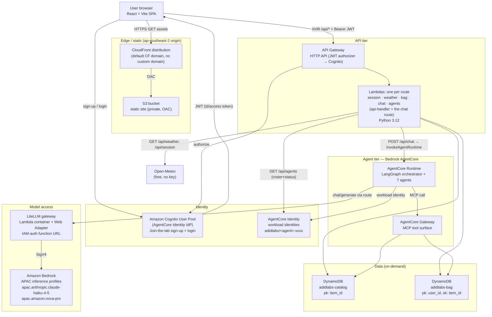
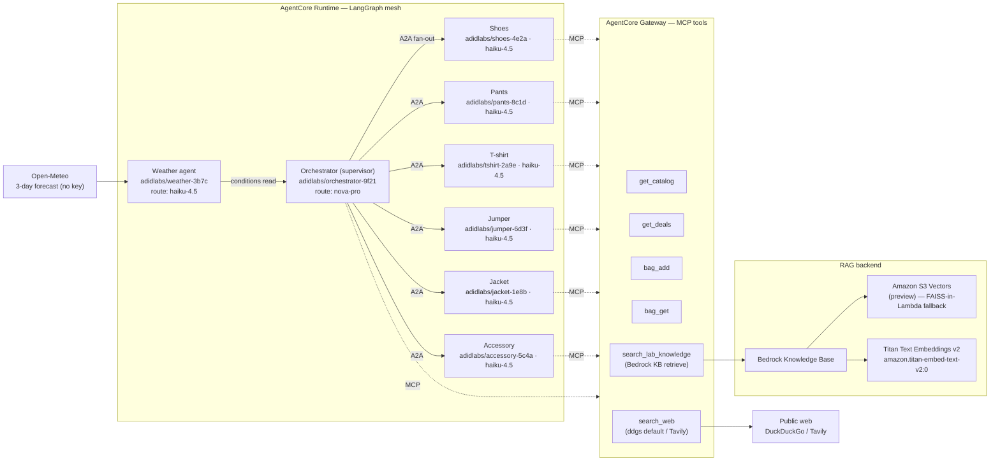

# AdidLaBs — AWS Architecture

> **Concept demo — no affiliation with adidas AG. All products fictional.**

AdidLaBs is a weather-aware AI shopping demo. A React storefront lets a user register, sign in, see their location/time/3-day forecast, chat with a stylist, and receive weather-matched outfit picks assembled by a mesh of specialist agents on **Amazon Bedrock AgentCore**. Everything is engineered around one hard constraint: **near-zero cost when idle** — no OpenSearch, no Fargate, no always-on compute. Every component is either static content, a request-scoped serverless function, or an on-demand data store.

**Region: `ap-southeast-2` (Sydney).** Every resource lives here. Foundation models are reached through **APAC cross-region inference profiles** (`apac.*` model IDs), invoked exclusively via **LiteLLM routes** — application code never names a raw model ID.

---

## 1. System architecture — the request stack



### 1.1 Layers

| Layer | Service | Role | Idle cost |
|---|---|---|---|
| Edge | **CloudFront** (default `*.cloudfront.net` domain) | TLS, caching, SPA delivery | $0 (pay per request/GB) |
| Static | **S3** (private, Origin Access Control) | React build artifacts | ~$0 (cents/GB-month) |
| Identity | **Cognito User Pool** as **AgentCore Identity** IdP | registration gate, login, JWT issuance | $0 (free tier covers demo MAU) |
| API | **API Gateway HTTP API** + **Lambdas** (one per route: session/weather/bag/chat/agents; the chat route is the `api-handler`, Python 3.12) | REST surface, orchestrates data + agents | $0 |
| Data | **DynamoDB** (`PAY_PER_REQUEST`) | catalog + bag | $0 (on-demand) |
| Agents | **AgentCore Runtime** + **Gateway** | LangGraph mesh + MCP tools | $0 (invocation-billed) |
| Models | **LiteLLM Lambda** → **Bedrock** APAC profiles | model routing, SigV4 | $0 (per-token only) |

Every box is request-scoped or storage-priced. Nothing runs a clock.

### 1.2 Request flows

**Cold start (registration gate).** The SPA loads from CloudFront/S3. Before anything unlocks, the user completes the **"Join the lab"** sign-up modal (Cognito). On successful login, Cognito returns a JWT; the SPA stores it and unlocks the stylist chat (auto-opens), weather bar, and IP-based location panel.

**Session bootstrap — `GET /api/session`.** Returns server time plus IP geolocation. The Lambda reads the caller's source IP (from the API Gateway request context / `X-Forwarded-For`) and resolves an approximate location; no third-party key required for the demo path.

**Weather — `GET /api/weather`.** The Lambda calls **Open-Meteo** (free, keyless) for a 3-day forecast at the resolved lat/lon and returns a compact payload the black weather strip renders.

**Bag — `GET | POST | DELETE /api/bag`.** CRUD against `adidlabs-bag`, scoped to the authenticated `user_id` taken from the JWT `sub` claim (never from the request body).

**Agents roster — `GET /api/agents`.** Returns the 8-agent roster with each agent's **AgentCore workload identity id**, model-route chip, and live status (`standby` → `running` after login). The frontend renders these ids verbatim.

**Chat — `POST /api/chat`.** The core flow:

1. SPA posts the user message + session context (location, forecast) to `/api/chat` with the Bearer JWT.
2. `api-handler` calls **`InvokeAgentRuntime`** on the AgentCore Runtime hosting the LangGraph orchestrator, passing `AGENTCORE_AGENT_ARN`.
3. The orchestrator (Nova Pro, via LiteLLM route `nova-pro`) reads the weather agent's read, then **fans out over A2A** to the six category agents (Haiku 4.5, via route `haiku-4.5`).
4. Agents call **MCP tools** on the AgentCore Gateway — `get_catalog`, `get_deals`, `bag_add`, `bag_get`, `search_lab_knowledge` (RAG), `search_web` (fallback).
5. The orchestrator composes a stylist reply + product picks; `api-handler` streams/returns it to the SPA.

---

## 2. Agent mesh — orchestration and tools



### 2.1 Roster (rendered verbatim by the frontend)

| Agent | Workload identity | Model route |
|---|---|---|
| Orchestrator (supervisor) | `adidlabs/orchestrator-9f21` | `nova-pro` |
| Weather | `adidlabs/weather-3b7c` | `haiku-4.5` |
| Shoes | `adidlabs/shoes-4e2a` | `haiku-4.5` |
| Pants | `adidlabs/pants-8c1d` | `haiku-4.5` |
| T-shirt | `adidlabs/tshirt-2a9e` | `haiku-4.5` |
| Jumper | `adidlabs/jumper-6d3f` | `haiku-4.5` |
| Jacket | `adidlabs/jacket-1e8b` | `haiku-4.5` |
| Accessory | `adidlabs/accessory-5c4a` | `haiku-4.5` |

### 2.2 Flow of a styling turn

1. **Weather read.** The weather agent normalizes the Open-Meteo 3-day forecast into a compact "conditions" object (temp band, precip, wind, day/season cues).
2. **Supervision.** The orchestrator (Nova Pro — the stronger reasoning route, reserved for planning/composition) decides which categories are relevant and dispatches an **A2A** request to each of the six category agents in parallel.
3. **Category work.** Each category agent (Haiku 4.5 — cheap, fast, high volume) queries structured data (`get_catalog`, `get_deals`) and pulls soft context (`search_lab_knowledge`) to justify picks (fabric/care, weather-to-outfit guidance, sizing).
4. **Knowledge miss → web.** If `search_lab_knowledge` returns nothing useful, the agent falls back to `search_web`.
5. **Composition.** The orchestrator merges category picks into one coherent outfit + rationale, optionally calling `bag_add`, and returns the stylist reply.

### 2.3 MCP tool surface (AgentCore Gateway)

| Tool | Backend | Notes |
|---|---|---|
| `get_catalog` | DynamoDB `adidlabs-catalog` | structured price/stock lookups — **not** RAG |
| `get_deals` | DynamoDB `adidlabs-catalog` | discounted items |
| `bag_add` | DynamoDB `adidlabs-bag` | scoped to `user_id` |
| `bag_get` | DynamoDB `adidlabs-bag` | current bag |
| `search_lab_knowledge` | **Bedrock KB `retrieve`** | semantic RAG over the lab corpus |
| `search_web` | **ddgs/DuckDuckGo** (free default); **Tavily** when `TAVILY_API_KEY` set | KB-miss fallback |

**Design rule:** structured facts (price, stock, deals) stay as plain DynamoDB tools; only unstructured, narrative knowledge (product stories, fabric/care, style guide, FAQ) goes through RAG. This keeps token cost and latency low and answers deterministic where they should be.

---

## 3. RAG design

**Goal:** give every agent one semantic tool — `search_lab_knowledge` — over a small markdown corpus, at pennies of idle cost.

### 3.1 Pipeline

```
S3 corpus (markdown)               Titan v2 embeddings            S3 Vectors index
 product stories        ──▶  amazon.titan-embed-text-v2:0  ──▶  (Bedrock Knowledge Base
 fabric / care sheets                                              vector store, preview)
 weather→outfit guide
 sizing / returns FAQ
```

1. **Corpus in S3.** Generated markdown: product stories, fabric/care sheets, a weather-to-outfit style guide, and a sizing/returns FAQ. Source mock data is sampled from HuggingFace `ashraq/fashion-product-images-small` (~200 metadata rows via the datasets-server REST API, mapped to the six categories with synthetic EUR prices/deals); `data/synthetic_fallback.json` (~40 items) covers HF outages. Dataset attribution + license note ship in `data/README.md`.
2. **Embeddings.** `amazon.titan-embed-text-v2:0` on Bedrock (invoked in-region, `ap-southeast-2`).
3. **Vector store.** A **Bedrock Knowledge Base over Amazon S3 Vectors** (preview). S3 Vectors is chosen deliberately over OpenSearch Serverless, whose ~$90+/mo minimum floor would break the budget; S3 Vectors bills in pennies and is available in `ap-southeast-2`.
4. **Provisioning.** The KB is created by **`data/setup_kb.py` via boto3**, *not* CloudFormation — S3 Vectors is preview and not yet a stable CFN resource type. The script creates the vector index, wires the KB data source to the S3 corpus, and triggers ingestion. Its output KB id is surfaced as **`KB_ID`**.
5. **Retrieval.** `search_lab_knowledge` calls the Bedrock Agent Runtime `retrieve` API against `KB_ID` and returns top-k passages with source citations for the agent to ground on.

### 3.2 FAISS-in-Lambda fallback

Because S3 Vectors is preview, the design carries a documented fallback that requires **no new always-on infrastructure**:

- Embed the same corpus with Titan v2 offline and build a **FAISS** index; store the index file on S3.
- The MCP tool Lambda loads the FAISS index from S3 on cold start (cached for the container's warm lifetime) and serves nearest-neighbour queries in-process.
- `search_lab_knowledge` keeps the same signature, so agents are unaffected by the swap. This preserves the near-zero-idle property: the index is an object in S3, and search runs only inside a request-scoped Lambda.

---

## 4. Model access via LiteLLM

- **LiteLLM runs as a Lambda container image** with the **AWS Lambda Web Adapter**, behind an **IAM-auth function URL** (`LITELLM_URL`). Stateless, no Postgres, **$0 idle**.
- Application/agent code calls **routes only**; LiteLLM maps them to APAC inference profiles and signs Bedrock calls with SigV4:

| Route | Target (APAC cross-region inference profile) | Used by |
|---|---|---|
| `nova-pro` | `bedrock/apac.amazon.nova-pro-v1:0` | orchestrator |
| `haiku-4.5` | `bedrock/au.anthropic.claude-haiku-4-5-20251001-v1:0` | all other agents |

Centralizing model access means a model swap is a one-line route change, and no agent ever hardcodes a region-specific model ID.

---

## 5. Environment variables

Exact names consumed across Lambdas / agents / tools:

| Variable | Purpose |
|---|---|
| `LITELLM_URL` | IAM-auth function URL of the LiteLLM gateway |
| `KB_ID` | Bedrock Knowledge Base id (from `data/setup_kb.py`) |
| `CATALOG_TABLE` | `adidlabs-catalog` DynamoDB table name |
| `BAG_TABLE` | `adidlabs-bag` DynamoDB table name |
| `AGENTCORE_AGENT_ARN` | ARN of the AgentCore Runtime to invoke for `/api/chat` |
| `DEMO_MODE` | toggles deterministic demo behaviour / seeded responses |
| `TAVILY_API_KEY` | optional; enables Tavily for `search_web` (else ddgs/DuckDuckGo) |

---

## 6. IAM posture

Least-privilege, per-component roles — no shared god-role. The API surface is
split across **five Lambda roles** (plus the Bedrock KB service role), not one
`api-handler` role, so each function carries only the grants its own route needs
and `dynamodb` never rides along with routes that don't touch a table:

- **Stateless role** (`session`, `weather`, `agents` Lambdas): CloudWatch Logs
  only. These handlers make outbound HTTPS (Open-Meteo, IP geolocation) and touch
  no AWS data — so no DynamoDB, Bedrock, or invoke grants at all.
- **Bag role** (`bag` Lambda): `dynamodb:GetItem/PutItem/UpdateItem/DeleteItem/Query`
  on the **`adidlabs-bag` table ARN only**. This is the *only* API-tier role that
  holds DynamoDB — the chat/orchestration path never gets table access.
- **Chat role** (`chat` Lambda, the orchestration api-handler):
  `lambda:InvokeFunctionUrl` (IAM auth, conditioned on `FunctionUrlAuthType = AWS_IAM`)
  on the **LiteLLM function ARN only**; `bedrock-agentcore:InvokeAgentRuntime`
  bounded to this account/region's runtimes, added only once `AGENTCORE_AGENT_ARN`
  is set (omitted at the first empty deploy). **No `dynamodb` and no
  `bedrock:InvokeModel`** — all model traffic goes through LiteLLM, and the bag
  table is reached only through the `bag` route's own role.
- **Tools role** (`tools` Lambda / MCP tools): DynamoDB item/query/scan on the
  **two table ARNs** (catalog + bag, for the catalog/deals/bag tools),
  `bedrock:Retrieve` bounded to this account/region's knowledge bases, plus (for
  the FAISS-in-Lambda fallback) `s3:GetObject` on the KB corpus bucket and
  `bedrock:InvokeModel` scoped to exactly `amazon.titan-embed-text-v2:0`.
- **LiteLLM Lambda role:** `bedrock:InvokeModel` / `InvokeModelWithResponseStream` scoped to the two APAC inference-profile ARNs (Haiku 4.5, Nova Pro) plus the underlying foundation-model ARNs the profiles route to; nothing else.
- **AgentCore Runtime execution role:** invoke the Gateway/MCP tools; call LiteLLM's function URL; `bedrock:Retrieve` on `KB_ID` (for `search_lab_knowledge`); `dynamodb:*Item/Query` on the two tables (for catalog/deals/bag tools); assume **workload identities** (`adidlabs/<agent>-xxxx`) via AgentCore Identity so each agent presents a distinct, auditable identity.
- **Function URL auth:** LiteLLM's URL is `AWS_IAM`, so only principals holding the explicit invoke grant reach it — never public.
- **CloudFront ↔ S3:** the site bucket is **private**; access is only via **Origin Access Control**. No public bucket, no ACLs.
- **API auth:** the HTTP API uses a **JWT authorizer** bound to the Cognito user pool; `user_id` is always derived from the token `sub`, never trusted from the client body.
- **Secrets:** `TAVILY_API_KEY` (when used) is injected as an environment secret; no long-lived cloud credentials are ever shipped to the browser.

---

## 7. Deploy / teardown

**One CloudFormation template** provisions the durable stack; a single boto3 script handles the preview-only KB.

**Deploy**
1. `npm run build` (Vite/React) → static assets.
2. `aws cloudformation deploy` (region `ap-southeast-2`) → S3, CloudFront (OAC), Cognito user pool, HTTP API + `api-handler` Lambda, both DynamoDB tables, LiteLLM Lambda container + IAM function URL, AgentCore Runtime + Gateway, and all IAM roles.
3. Sync built assets to the site S3 bucket; invalidate the CloudFront cache.
4. Seed data: fetch/sample the HF dataset (or `synthetic_fallback.json`), write catalog rows to DynamoDB, and generate the markdown corpus into the S3 KB bucket.
5. `python data/setup_kb.py` — creates the S3 Vectors index + Bedrock KB, ingests the corpus, prints `KB_ID`; set it as a stack/Lambda env var.

**Teardown**
1. Delete the KB + S3 Vectors index (`data/setup_kb.py --teardown`, since they were made outside CFN).
2. Empty the S3 buckets (site + corpus).
3. `aws cloudformation delete-stack` — removes everything else.

Because nothing runs when idle, a deployed-but-unused stack costs effectively nothing; teardown drives it to zero.

---

## 8. Why every choice is near-zero idle cost

| Alternative rejected | Idle floor | AdidLaBs choice | Idle cost |
|---|---|---|---|
| OpenSearch Serverless (vector) | ~$90+/mo | **S3 Vectors** (or FAISS-in-Lambda) | pennies / $0 |
| Fargate / ECS for LiteLLM | always-on vCPU/RAM | **LiteLLM on Lambda** (Web Adapter, IAM URL) | $0 |
| RDS/Postgres for LiteLLM state | always-on instance | **stateless LiteLLM**, no DB | $0 |
| Provisioned DynamoDB | reserved capacity | **`PAY_PER_REQUEST`** | $0 |
| EC2 web host | always-on | **S3 + CloudFront** static | ~$0 |
| Self-hosted auth | server | **Cognito** (free-tier MAU) | $0 |

Idle cost is the sum of: a few S3 objects, one CloudFront distribution at rest, two empty-ish on-demand tables, and dormant Lambdas/agents. All meaningful spend is per-request foundation-model tokens.

---

## 9. Runtimes

- **Python 3.12** — Lambdas (`api-handler`, LiteLLM container, MCP tool functions), agents, and tools.
- **Node ≥ 20 + Vite + React** — frontend SPA.

---

## 10. Brand & licensing

- **AdidLaBs** wordmark: **ADID** + serif-italic amber **L** + **A** + serif-italic amber **B** + **S**. Fonts: **Anton + Oswald + DM Serif Display italic** (Google Fonts). A lab-flask mark stands in for any adidas device.
- **No adidas trademarks:** no three stripes, no trefoil, no adidas product names or imagery. All products fictional.
- **License:** MIT, © **cyberaidev**. Repository: `github.com/cyberaidev/AdidLaBs`.
- Every public-facing doc and the site footer carry: **"Concept demo — no affiliation with adidas AG. All products fictional."**
